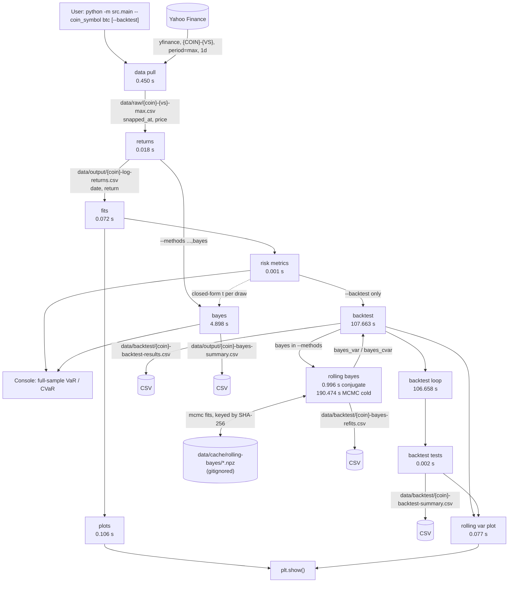

# App Flow: Crypto Risk Engine

> Educational project, not investment advice. Planned steps are marked **Planned**. File layouts are in [SCHEMA.md](SCHEMA.md).

## User flow
1. Install: `python -m venv .venv`, activate, `pip install -r requirements.txt`.
2. Run `python -m src.main --coin_symbol btc` (add `--vs_currency`, `--alpha`, `--backtest`, `--window_size`, `--methods normal,t,hist,bayes` and the Bayes flags `--seed`, `--draws`, `--tune`, `--chains`, `--hdi_prob` as needed; for the rolling Bayes backtest add `--backtest` with `bayes` in `--methods`, plus `--bayes_engine`, `--refit_every`, `--bt_draws`, `--bt_tune`, `--bt_chains`, `--no_cache`). Use `--log-level INFO` to print per-stage start/end times, `--profile` to print a timing table and write `data/output/{coin}-timings.csv` (gitignored), and `--no_plots` to skip plot generation and `plt.show()`.
3. Read the console: return summary stats, then VaR / CVaR at `alpha` for each selected method (default Normal and Student-t). With `bayes`: predictive VaR / CVaR, posterior mean and HDI, the mu / sigma / nu posterior table with R-hat and ESS, any diagnostic warnings, and the sampling time. With `--profile`, a stage timing table is printed at the end.
4. Inspect the plot windows (PDF overlay, QQ plots, left-tail density; plus rolling VaR with `--backtest`). Closing them ends the run. `--no_plots` skips this step.
5. With `--backtest`, read the printed summary table (breaches, Kupiec / Christoffersen p-values, reject flags) and the CSVs under `data/backtest/`. With `bayes`, a progress bar per refit and one line with the refit count, cache hits and refits that failed the MCMC diagnostics come first; the per-refit details are in `data/backtest/{coin}-bayes-refits.csv`.
6. If working in git, run `git restore data/` to restore the committed data files the run overwrote.

## Data flow

Stage names in the boxes match `src/timing.py` (and `--profile` / `--log-level INFO` output) one to one. Times below are from real BTC-USD runs on 2026-11-20 (America/New_York), alpha 0.05, window 252, live Yahoo data 2014-09-18 to 2026-11-20 (4,447 log returns; 4,195 forecast days). Compute stages are from `python -m src.main --coin_symbol btc --backtest --methods normal,t,hist,bayes --bayes_engine conjugate --profile --no_plots` (run_id `20261120T224639Z-f16ad198`). `plots` (0.106 s) is from a follow-up `src.main` run the same day with figures generated under the Agg backend. `rolling var plot` (0.077 s) was timed on that conjugate backtest output with figures closed. The MCMC `rolling bayes` time is from a separate cold-cache run (`--bayes_engine mcmc --no_cache --profile --no_plots`, run_id `20261120T225220Z-a4701dab`, 200 refits in 190.474 s).

```mermaid
flowchart TD
    U["User: python -m src.main --coin_symbol btc [--backtest]"] --> DP
    Y[(Yahoo Finance)] -->|"yfinance, {COIN}-{VS}, period=max, 1d"| DP["data pull<br/>0.450 s"]
    DP -->|"data/raw/{coin}-{vs}-max.csv<br/>snapped_at, price"| RET["returns<br/>0.018 s"]
    RET -->|"data/output/{coin}-log-returns.csv<br/>date, return"| FITS["fits<br/>0.072 s"]
    FITS --> RM["risk metrics<br/>0.001 s"]
    FITS --> PLOTS["plots<br/>0.106 s"]
    RM --> OUT1["Console: full-sample VaR / CVaR"]
    RM -->|"--backtest only"| BT["backtest<br/>107.663 s"]
    BT --> LOOP["backtest loop<br/>106.658 s"]
    LOOP --> BTT["backtest tests<br/>0.002 s"]
    BT -->|"data/backtest/{coin}-backtest-results.csv"| F1[(CSV)]
    BTT -->|"data/backtest/{coin}-backtest-summary.csv"| F2[(CSV)]
    BT --> RVP["rolling var plot<br/>0.077 s"]
    BTT --> RVP
    PLOTS --> SHOW["plt.show()"]
    RVP --> SHOW
    RET -->|"--methods ...,bayes"| BAYES["bayes<br/>4.898 s"]
    RM -.->|"closed-form t per draw"| BAYES
    BAYES --> OUT1
    BAYES -->|"data/output/{coin}-bayes-summary.csv"| F3[(CSV)]
    BT -->|"bayes in --methods"| RB["rolling bayes<br/>0.996 s conjugate<br/>190.474 s MCMC cold"]
    RB <-->|"mcmc fits, keyed by SHA-256"| CACHE[("data/cache/rolling-bayes/*.npz<br/>(gitignored)")]
    RB -->|"bayes_var / bayes_cvar"| BT
    RB -->|"data/backtest/{coin}-bayes-refits.csv"| F4[(CSV)]
```

## CLI paths

| Command | What runs | Files written |
|---|---|---|
| `python -m src.main --coin_symbol btc` | ETL -> fits -> 3 diagnostic plots -> prints Normal and Student-t VaR / CVaR | `data/raw/btc-usd-max.csv`, `data/output/btc-log-returns.csv` |
| `python -m src.main --coin_symbol btc --backtest [--window_size 252] [--alpha 0.05]` | Above, plus rolling backtest (tqdm progress bar, about 2 min for BTC), summary table, rolling VaR plot | Above, plus `data/backtest/btc-backtest-results.csv`, `data/backtest/btc-backtest-summary.csv` |
| `python -m src.api` / `python -m src.returns` | Single ETL step | raw CSV / returns CSV |
| `python -m src.distributions` / `src.risk_metrics` / `src.visualization` | Read the existing returns CSV; print fits / risk metrics incl. Historical (alpha 0.05) / show plots | none |
| `python -m src.main --coin_symbol btc --methods normal,t,bayes --backtest [--bayes_engine mcmc] [--refit_every 21]` | Above, plus the full-sample Bayes and a rolling Bayes backtest column (MCMC every 21 days: about 3-4 min extra for BTC with a cold cache, seconds when cached) | Above, plus `data/output/btc-bayes-summary.csv`, `data/backtest/btc-bayes-refits.csv`, cache files under `data/cache/rolling-bayes/` |
| `python -m src.main ... --backtest --methods normal,t,bayes --bayes_engine conjugate` | Rolling Bayes with the Normal-Inverse-Gamma engine, refit daily (under 1 s extra) | Same files, no cache |
| `python -m src.backtest [--methods normal,student_t,historical,bayes] [--bayes_engine ...] [--save]` | Backtest the existing returns CSV (no download) and print results and runtime | none, or the `data/backtest/` CSVs with `--save` |
| `python -m pytest` | 67 unit tests on synthetic data (no network; Bayes tests use tiny seeded MCMC, about 15 s total; `-m "not slow"` skips the 2 slow tests) | none |
| `python -m src.main --coin_symbol btc --methods normal,t,hist,bayes [--seed 42] [--draws 1000] [--tune 1000] [--chains 4] [--hdi_prob 0.94]` | Default run, plus Historical metrics and the PyMC Bayesian Student-t (about 5 s extra for BTC) | Default-run files, plus `data/output/btc-bayes-summary.csv` |
| `python -m src.bayes --coin_symbol btc` | Bayes only, on the existing returns CSV; prints results | none |

| `python -m src.main --coin_symbol btc --backtest --methods normal,t,hist,bayes --bayes_engine conjugate --profile --no_plots` | Profiled pipeline (no plots); prints a stage table and writes `data/output/btc-timings.csv` (gitignored) | raw and returns CSVs, backtest CSVs, bayes summary, timings CSV |

## Ranked bottlenecks

Times below are wall-clock seconds from the 2026-11-20 BTC runs described under the diagram. Nested stages are listed under their parent; they are already included in the parent total, so they are not added again.

| Rank | Stage | Seconds | Notes |
|---|---|---|---|
| 1 | backtest loop | 106.658 | Student-t MLE (and Normal / Historical) refit on every one of 4,195 windows. Dominates the conjugate run (94% of the 113.102 s top-level total) |
| 2 | bayes | 4.898 | Full-sample PyMC Student-t (4 chains x 1,000 draws, 1,000 tune) |
| 3 | rolling bayes (conjugate) | 0.996 | Daily Normal-Inverse-Gamma refits; cheap next to the MLE loop |
| 4 | data pull | 0.450 | Yahoo Finance download; varies with the network |
| 5 | plots | 0.106 | PDF overlay, QQ, left-tail density (Agg backend, figures closed) |
| 6 | rolling var plot | 0.077 | Rolling VaR chart of the conjugate backtest (figures closed) |
| 7 | fits | 0.072 | Full-sample Normal and Student-t MLE |
| 8 | returns | 0.018 | Log-return transform |
| 9 | backtest tests | 0.002 | Kupiec / Christoffersen on the breach series |
| 10 | risk metrics | 0.001 | Full-sample VaR / CVaR printout |

With `--bayes_engine mcmc --no_cache` on the same day and data, `rolling bayes` became the slowest stage at 190.474 s (200 refits, 0 cache hits; 25 of 200 failed the R-hat check, all R-hat only). The `backtest loop` in that run was 100.323 s, and the top-level total was 295.995 s. Caching MCMC fits (the default) is the first lever for that path; speeding up the Student-t MLE loop is the first lever for every `--backtest` run. Both are Phase 7 candidates.

## Backtest timing (no look-ahead)
For each day `i` from `window_size` to `n-1`: fit on returns `[i-window_size, i)`, forecast VaR/CVaR for day `i`, flag a breach if `return_i < VaR_i`. The first `window_size` days have no forecast, so `total_periods = n - window_size`.

Rolling Bayes (`--refit_every k`): refit only on days `r = window_size, window_size + k, ...`, each fit on returns `[r - window_size, r)`, and reuse that posterior for days `r .. r + k - 1`. No forecast ever sees its own day or later; with `k > 1` the posterior can be up to `k - 1` days stale. Details in [TRD.md](TRD.md#rolling-bayesian-backtest-phase-4---backtest---methods-bayes).
